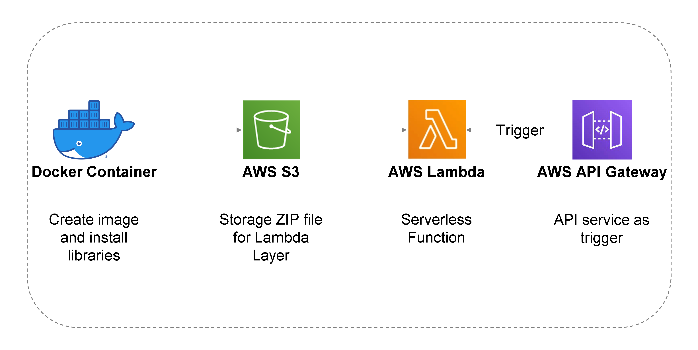

# Serverless Custom Chatbot with OpenAI API and AWS

Here is a step by step tutorial of how to use OpenAI API, specificly, with ChatGPT model, for adapting a customable solution for any end you’d like. The better: how to do it Serverless without knowing about how to configure servers, deployments and else.

For this proposal, I used Docker, AWS S3, AWS Lambda and AWS API Gateway. Here a diagram for more graphic understanding:



## Prerequisites
- Docker Installed ([Linux](https://docs.docker.com/engine/install/ubuntu/), [Windows](https://docs.docker.com/desktop/install/windows-install/))
- [AWS Account](https://aws.amazon.com/)
- [OpenAI](https://platform.openai.com/overview) Account and Token

## Steps:
1. [Create a Docker Container](docker_image.sh)
2. Upload zip file to S3
    ```
    aws s3 cp openai.zip s3://[S3 Bucket for upload layer]/openai.zip --profile [aws-cli-profile]
    ```
3. Generate Lambda Function in AWS
    - Creat code in [Lambda Function](lambda.py)
    - [Test the function](test_function.txt)
    - Add an API Gateway as a Trigger
    - Test [Lambda Function in a Terminal](test_function_in_terminal.sh)

See the full guide [here](https://medium.com/@data-for-dummies/how-i-built-a-serverless-custom-chatbot-with-chatgpt-api-and-aws-in-10-minutes-22b373d1e05a)
